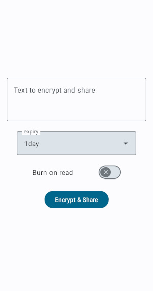
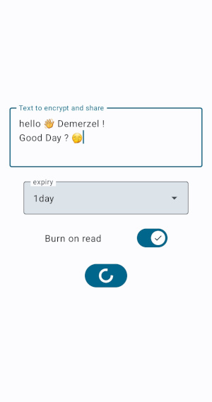

# Share Paste O₂

## Introduction

Share Paste is a [privatebin](https://privatebin.net/) client for android.  

This app allows you to quickly share text, in such a way that the hosting privatebin server
can't read contents of the paste you have shared. Or in other words, your share is _end to end encrypted_.
Also you can set your paste to expire and auto destruct 💣 after a set duration. Or burn
on read 🔥 (Mission Impossible style) if you like, to prevent unintended persons from accessing it later.

**What you might use this for?**

* You have to share some sensitive info quick and your messenger does not support E2EE
  (or you can't trust it's security enough).
* You need to share some text on a forums/discord/irc but don't want it to linger online for eternity.
* You want to post something anonymously that should be visible only for limited duration.
* You love burn on read feature just cuz, or wish to surprise someone with a special message. Happy Birthday ;)
* And more. Use your imagination!

### Where to get it?

Please see [releases](https://github.com/nain-F49FF806/sharepaste.oo/releases).

F-droid packaging is intended. Assistance towards this goal is appreciated.  

## How it works?

In short:

1. A secure key is randomly generated and used to encrypt your paste, _on device_. #local
2. The _encrypted paste_ is sent to the server, who responds with location of your _temporarily_ saved opaque paste. #remote
3. The paste location and the secret used to derive key are merged into a link that you can share with intended receiver.

When receiver opens the link, the encrypted paste is retrieved, and _decrypted locally_, with server none the wiser regarding it's contents.
If set to Burn On Read, the server also _immediately_ deletes the paste after it has been retrieved once.

## Developer section

This app is powered by Kotlin 🏝️ and Rust 🦀.  

* Encryption and sending uses Rust code, using the same library that powers [pbcli].
* UI is written in Jetpack Compose with Kotlin helping wrap the Rust library.
* Bridging between Rust world and Java/Kotlin world is thanks to UniFFI project by Mozilla.

### How to build

This project sources the pbcli library dependency as a git submodule.
Assuming you have already cloned this repository like so.

    git clone https://github.com/nain-F49FF806/sharepaste.oo.git

Next we need to init and retrieve the submodule

    git submodule update --init 

You will also need [cargo-ndk](https://github.com/bbqsrc/cargo-ndk) installed to build this library for Android.

    cargo install cargo-ndk

After this you should be able to open the android folder in Android Studio and run build.

### Project structure

| Location                      | Notes                                                                                        |
| ----------------------------- | -------------------------------------------------------------------------------------------- |
| rust/pbcli                    | rust library with uniffi bindings. Implements the privatebin api. Loaded as git submodule    |
| android/rsnative              | Module to build rust libraries for android native and to contain their wrapping kotlin code. |
| android/rsnative/build.gradle | Customizable configuration for above (see `cargoNdk` section)                                |
| android/app                   | User facing, android app features                                                            |

### Build variants / flavors

This app comes in 3 flavors, with only difference being the icons used / theme customization to help tell the source.

|     | flavor                | purpose                                                                                                       |
| --- | --------------------- | ------------------------------------------------------------------------------------------------------------- |
| 1   | **ambient** (default) | You should use this for local builds or redistribution. You may replace the icon, but not adapt or modify it. |
| 2   | **fdroid**            | This flavor is for official f-droid distribution.                                                              |
| 3   | **original**          | This is for builds from the original source repo. you are not granted rights to use media from this flavor.   |

## Contributing

Contributions are welcome. Both, code and non-code contributions are appreciated.

Any code contributions shall be assumed to come with same license as the repository,
unless you explicitly make additional grants.

Some ideas / Current to do:

* ~~Receive text share intents, so we can encrypt the shared text~~ [[done](https://github.com/nain-F49FF806/sharepaste.oo/commit/1830278f96e2c414f7b7f2355b6ef0442f909950)]
* Receive arbitrary file share intents, so we can  encrypt as attachment
* Keep a record of shared links (configurable), and their expiry date/time

Once Share Paste is aware of attachments, we can start opening (decryption) links locally.

## Credits

* The [`uniffi-starter`] template by Ian Wagner provides the base for Android <=> Rust bridge setup.
* [pbcli] developer Mydayyy. Thanks for such enthusiastic, swift and smooth collaboration.
* Mozilla & community for actively working on their [UniFFI] system and fielding questions.
* [Phind-34B] provided initial guidance in regard to Compose UI.
* Me, for sticking through the tough bits and bringing this to you! :)

[`uniffi-starter`]: https://github.com/ianthetechie/uniffi-starter
[pbcli]: https://github.com/Mydayyy/pbcli
[UniFFI]: https://github.com/mozilla/uniffi-rs
[Phind-34B]: https://phind.com
